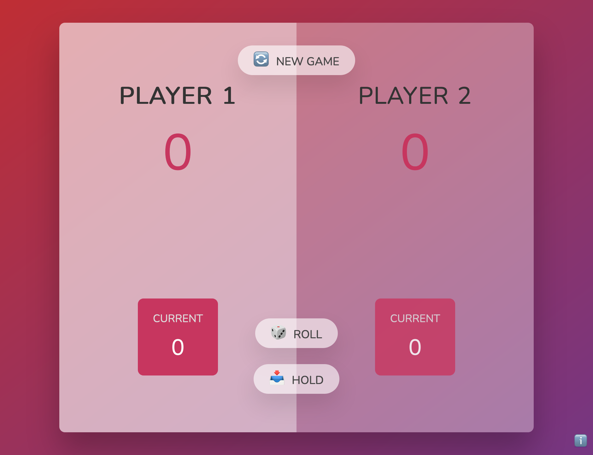
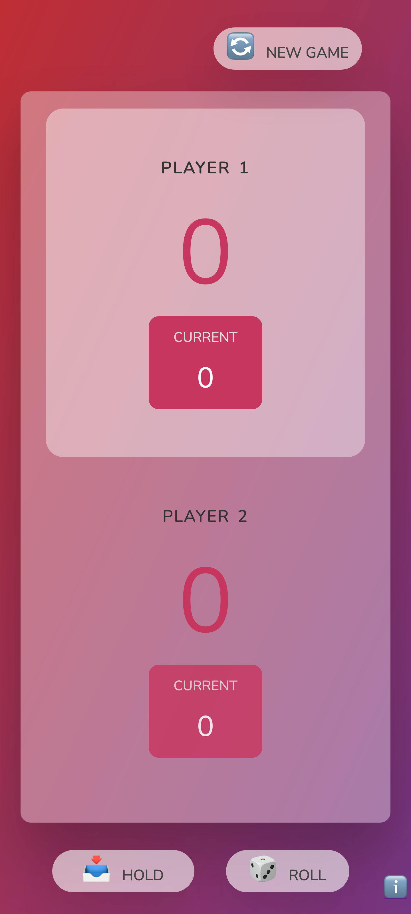

# pig-game

## Instruction:
The game of Pig is a very simple jeopardy dice game in which two players race to reach *100 points*. Each turn, a player repeatedly rolls a die until either a 1 is rolled or the player holds and scores the sum of the rolls (i.e Current Score). At any time during a player's turn, the player is faced with two decisions:

**ROLL** - If the player rolls a:

>1: the player scores nothing and it becomes the opponent's turn.

>2 - 6: the number is added to the player's turn total and the player's turn continues.

**HOLD** - The turn total is added to the player's score and it becomes the opponent's turn.

## Screenshots:

### Desktop:

### Tab:

### Mobile:

## Reference:
Know the game: ([Wikipedia](https://en.wikipedia.org/wiki/Pig_(dice_game)))
